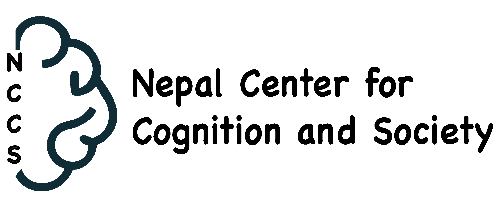

<!-- 

 -->

  <!-- <h2>Nepal Center for Cognition and Society (NCCS)</h2> -->

  

  

<!-- 
 
  Nepal Center for Cognition and Society (NCCS)
  is an independent, not-for-profit research organization founded in Bhadrapur, a south-east town of Nepal. 
  We are researchers with diverse backgrounds in cognitive and psychological sciences, neuroscience, linguistics, computer science, philosophy, sociology, and health sciences.
  We aim to understand cognition and cognitive processes in humans and animals using behavioral, neuroimaging, electrophysiological, and computational methods and tools in multidisciplinary and interdisciplinary teams.

-->

<!--

Emerging cognitive and brain sciences research initiative working on cross-cultural non-WEIRD cognition.
 
 
Advancing cognitive science from one of the world's most linguistically and culturally diverse and scientifically underrepresented regions.

   
<!--

 <h3>What we do</h3> 

- Conduct cognitive science research in resource-constrained setting 
- Build datasets and evidence from underrepresented populations
- Train students and support science education

**We are currently operating as a distributed research network with collaborators in Nepal and internationally.**
**Lab access and infrastructure are being established through institutional partnerships.**-->

NCCS is an autonomous non-profit academic research organization established in Bhadrapur, southeastern Nepal, registered in 2025.

We aspire to conduct globally relevant, locally grounded cognitive science research in the linguistically and socio-culturally diverse context of Nepal.
Currently, we are a small interdisciplinary team of researchers based across Nepal and collaborating internationally.
Alongside developing research projects and collaborations,
we mentor trainee students and introduce them to the field of cognitive science and related health sciences.

We contribute to the inclusion of underrepresented communities from the Global South in the science of the mind and brain, both as a source of cognitive processes to study and as the scientists who study them.

At NCCS, we aim to bring together researchers from diverse fields like neuroscience, psychology, linguistics, philosophy, AI/computer science, anthropology, education, and more to
better understand human cognition from inter- and trans-disciplinary perspectives.

Researchers currently at and associated with NCCS have experience working at international universities, research institutes, and clinical settings across the domains of psycholinguistics, neuroscience, language and communication health, and related disciplines, with publications in international peer-reviewed journals.

At present, our research projects are at multiple stages.
One grant application is under development.
One project is under IRB review.
One manuscript is underway and one has already been published.

***

*We are actively seeking collaborations from researchers, scientists, clinicians, healthcare organizations, institutions, and universities working in related areas.*\
*We invite funders globally to collaborate with us if your interests align with ours in cognitive and related health sciences in underrepresented low-resource settings.*
