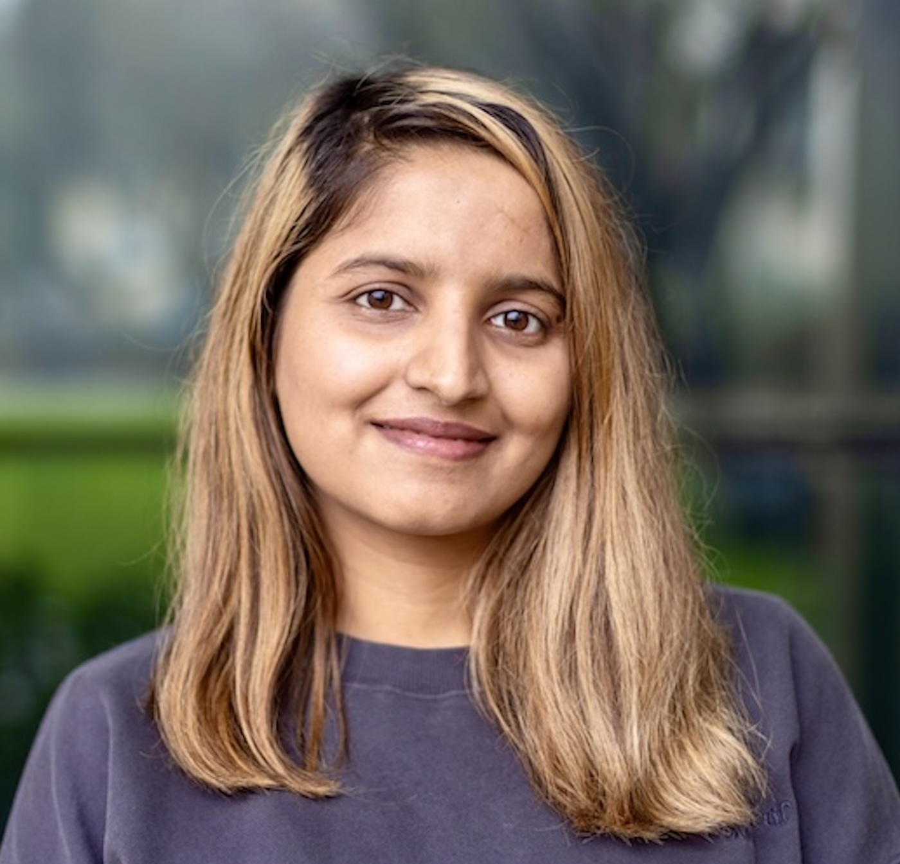
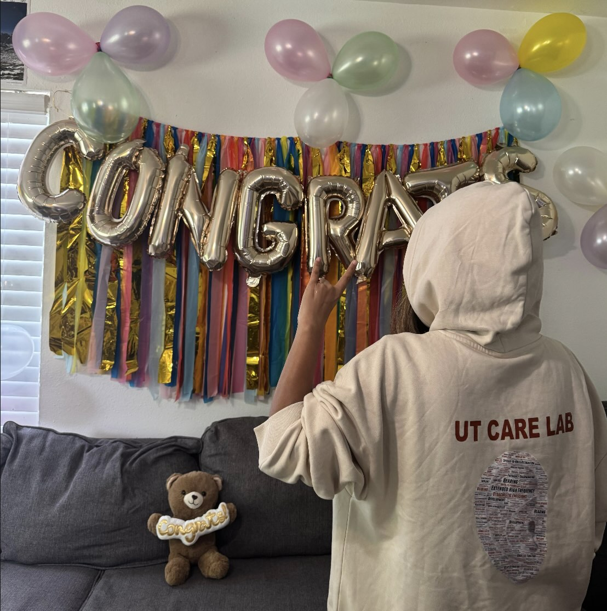

<!-- {fig-align="center"} -->

On April 9, NCCS researcher [Sajana Aryal](../../team/sajana/sajana.html) successfully defended her PhD (thesis titled *Individual differences in cochlear compression reveal incipient cochlear changes in normal-hearing adults*).
She is now a PhD graduate from the University of Texas at Austin.
Soon she will come with the news of her postdoc journey. Stay tuned. ;) 

Congrats Dr. Aryal! 🎉

{fig-align="center" width="175" height="auto"}

***

{fig-align="center" width="250" height="auto"}

