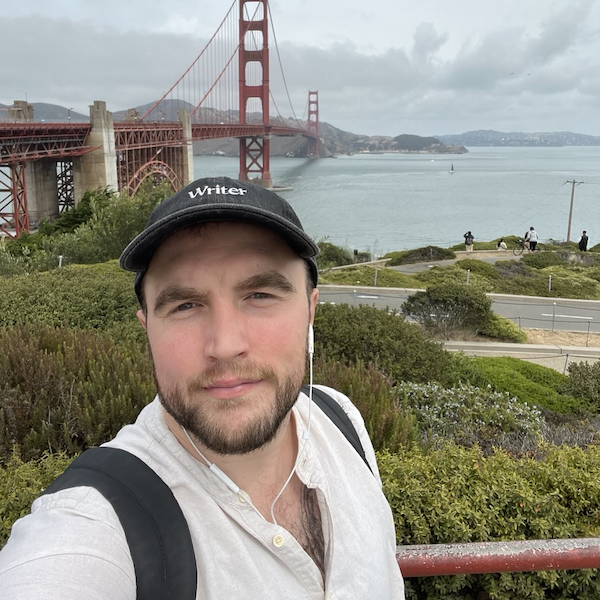

:::: {.columns}

::: {.column width="35%"}

 
<i class="bi bi-linkedin"></i> <a href="https://www.linkedin.com/in/biraj-bhattarai-3172931a3/" target="_blank">LinkedIn</a>

:::

::: {.column width="3%"}
<!-- empty space between image and text -->
:::

::: {.column width="62%"}
Kirk is an NLP Engineer with an expertise in natural language processing, linguistics, and cognitive neuroscience.
He has a blend of experience working across academia and industry.
He has studied and researched topics like eye movements in reading (at the University of Massachusetts [Amherst](https://www.umass.edu/)) and auditory feedback alteration in speech production (at the Basque Center on Cognition, Brain and Language, [BCBL](https://www.bcbl.eu/en)).
Following that, he worked on Siri at [Apple](https://apple.com/) as a linguist. Currently, he is an NLP Engineer at [Writer Inc.](https://writer.com/) working on the application and development of AI and AI-adjacent technologies.

:::

::::
